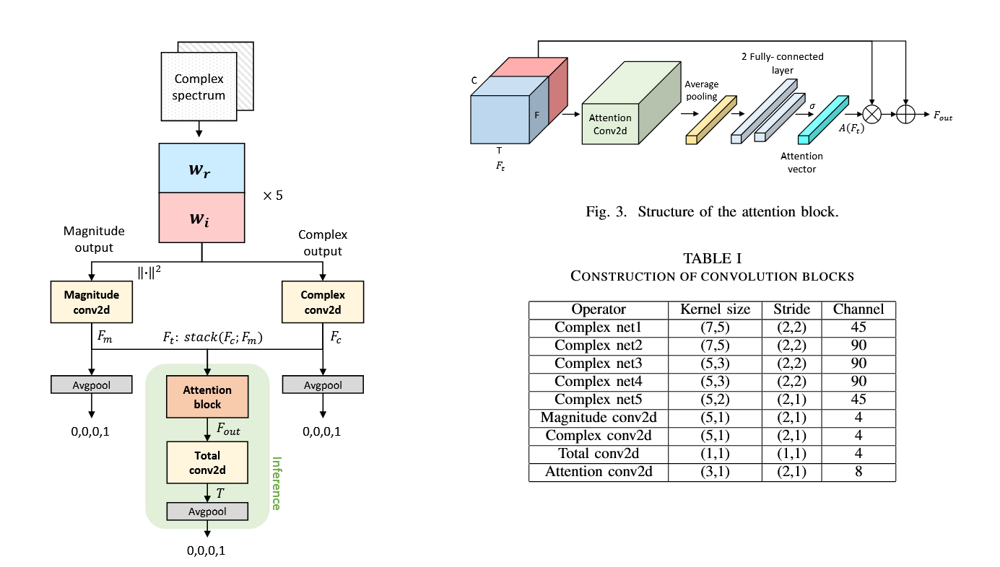

# 🎵 MIMIMI: Self-supervised Complex Network for Machine Sound Anomaly Detection

> A PyTorch implementation of the EUSIPCO 2021 paper ["Self-supervised Complex Network for Machine Sound Anomaly Detection"](https://eurasip.org/Proceedings/Eusipco/Eusipco2021/pdfs/0000586.pdf) by Kim et al.

[](https://www.python.org/downloads/)
[](https://pytorch.org/)
[](https://opensource.org/licenses/MIT)

## 📋 Overview

**MIMIMI** implements a novel deep complex neural network for machine sound anomaly detection using phase-aware spectral analysis. The model leverages complex-valued convolutions and attention mechanisms to capture both magnitude and phase information from audio spectrograms, achieving superior performance over traditional magnitude-only approaches.

### Features

- **Complex-valued Neural Networks**: Full complex arithmetic throughout the network
- **Phase-aware Processing**: Utilizes both magnitude and phase information
- **Attention Mechanism**: Adaptive weighting of magnitude vs. complex features
- **Self-supervised Learning**: Trains on normal sounds only using machine ID classification
- **Multi-branch Architecture**: Separate processing paths for magnitude, complex, and combined features

## 🏗️ Architecture

The network consists of three main components:

1. **Complex Convolutional Backbone**: 5 complex convolution blocks with PReLU activation
2. **Dual-path Processing**: Separate branches for magnitude and complex features  
3. **Attention Fusion**: Channel attention to weight magnitude vs. complex contributions



## 📊 Results

### Performance Comparison

> [!IMPORTANT]  
> The following table compares the paper's results, which used the complete MIMII dataset (30+ GB), compared to mine which uses only the development subset (~4 GB).

| Machine Type | Paper (%) | Best Machine ID (%) | Average of all IDs (%) |
|--------------|-----------|---------------------|------------------------|
| Fan          | 96.40     | 88.33               | 83.43                  |
| Pump         | 98.75     | 99.48               | 87.15                  |
| Slider       | 96.87     | 99.84               | 92.35                  |
| Valve        | 96.87     | 93.06               | 85.22                  |
| **Average**  | **97.22** | **95.18**           | **87.04**              |

> [!NOTE]  
> The paper didn't mention if it highlighted the best performing machine ID or the average across all IDs.
> Therefore, I decided to show both.

### Detailed Results by Machine ID

#### Fan (4 Machine IDs)

- Overall AUC: **83.43%**
- Best performing ID: **88.33%** (ID 1)
- Range: 73.48% - 88.33%

#### Pump (4 Machine IDs)  

- Overall AUC: **87.15%**
- Best performing ID: **99.48%** (ID 2)
- Range: 51.69% - 99.48%

#### Slider (4 Machine IDs)

- Overall AUC: **92.35%**
- Best performing ID: **99.84%** (ID 2)  
- Range: 73.94% - 99.84%

#### Valve (4 Machine IDs)

- Overall AUC: **85.22%**
- Best performing ID: **93.06%** (ID 0)
- Range: 79.94% - 93.06%

## 🚀 Quick Start

### Prerequisites

- **Python 3.8+** (mandatory)

```bash
pip install -r requirements.txt
```

### Dataset Download

The implementation uses the MIMII dataset (development subset) from [Zenodo](https://zenodo.org/records/3678171):

```bash
cd data
python download_data.py
```

The script will automatically download and extract:

- `dev_data_fan.zip`
- `dev_data_pump.zip`
- `dev_data_slider.zip`
- `dev_data_valve.zip`

### Training

Train models for all machine types:

```bash
python main.py --mode train
```

Or train a specific machine type:

```bash
python train.py  # Will train all types in config.MACHINE_TYPES
```

### Evaluation

Evaluate trained models:

```bash
python main.py --mode evaluate
```

## 📁 Project Structure

```txt
mimimi/
├── src/
│   ├── model.py              # Main complex anomaly detector
│   ├── complex_layers.py     # Complex convolution, batch norm, PReLU
│   ├── attention.py          # Channel attention mechanism
│   ├── dataset.py            # MIMII dataset loader with complex STFT
│   ├── train.py              # Training pipeline with mixup support
│   ├── evaluate.py           # Comprehensive evaluation metrics
│   ├── config.py             # Configuration parameters
│   └── utils.py              # Utility functions (Youden threshold)
├── data/
│   └── download_data.py      # Automated dataset download
├── models/                   # Saved models and metrics
└── logs/                     # Training logs
```

## 🔬 Technical Implementation

### Complex Neural Network Components

#### 1. Complex Convolution

Complex multiplication follows the mathematical rule:

$(a + bi) \times (c + di) = (ac - bd) + (ad + bc)i$

Where:
- Real output: $conv_{real}(real) - conv_{imag}(imag)$
- Imaginary output: $conv_{real}(imag) + conv_{imag}(real)$

#### 2. Complex Batch Normalization

For complex input $z = x + iy$, normalization is applied separately to real and imaginary components:

- Real part: $x_{\text{norm}} = \frac{x - \mu_x}{\sigma_x + \epsilon}$
- Imaginary part: $y_{\text{norm}} = \frac{y - \mu_y}{\sigma_y + \epsilon}$  
- Output: $z_{\text{norm}} = x_{\text{norm}} + iy_{\text{norm}}$

#### 3. Attention Mechanism

Channel-wise attention to balance magnitude vs. complex features:

$F_{\text{out}} = A(F_t) \odot F_t + F_t$

Where:
- $A(F_t) = \text{softmax}(\text{FC}_2(\text{ReLU}(\text{FC}_1(\text{GAP}(F_t)))))$
- $\odot$ denotes element-wise multiplication
- $\text{GAP}$ is Global Average Pooling

### Training Strategy

- **Self-supervised Learning**: Machine ID classification on normal sounds only
- **Multi-loss Training**: Combined losses from magnitude, complex, and fused branches
- **Complex STFT**: Input preprocessing preserves phase information
- **Data Augmentation**: Spectral masking, noise injection, frequency shifting

### Key Hyperparameters

| Parameter | Value | Description |
|-----------|-------|-------------|
| Sample Rate | 16 kHz | Audio sampling frequency |
| FFT Size | 1024 | STFT window size |
| Hop Length | 512 | STFT hop size |
| Frames | 64 | Time frames per sample |
| Learning Rate | 1e-4 | Adam optimizer learning rate |
| Batch Size | 32 | Training batch size |
| Epochs | 30 | Maximum training epochs |
| Patience | 20 | Early stopping patience |

## 🎯 Anomaly Detection Strategy

The model detects anomalies through **classification confidence scoring**:

1. **Training Phase**: Learn to classify machine IDs of normal sounds
2. **Test Phase**: High cross-entropy loss indicates inability to classify → anomaly
3. **Threshold**: Optimal threshold found using Youden's J statistic

```python
def get_anomaly_score(self, x, true_class):
    _, _, logits_total = self.forward(x)
    return F.cross_entropy(logits_total, true_class, reduction='none')
```

## 📈 Evaluation Metrics

The implementation provides comprehensive evaluation:

- **AUC-ROC**: Area under receiver operating characteristic curve
- **Precision/Recall/F1**: Binary classification metrics at optimal threshold  
- **Per-Machine Analysis**: Individual machine ID performance
- **Confusion Matrices**: Classification and anomaly detection confusion matrices
- **Score Distributions**: Visualization of normal vs. anomalous score distributions

## 🔍 Analysis & Insights

### Strengths of the Implementation

1. **Complete Complex Processing**: Full complex arithmetic pipeline maintained
2. **Faithful Architecture**: Closely follows paper specifications
3. **Comprehensive Evaluation**: Detailed metrics and visualizations
4. **Robust Training**: Early stopping, validation monitoring, model checkpointing

### Performance Analysis

- **Slider machines**: Best performance (92.35%), demonstrating clear phase differences
- **Pump machines**: Moderate performance (87.15%), some IDs excel (99.48%)  
- **Valve machines**: Good performance (85.22%), consistent across most IDs (93.06% best)
- **Fan machines**: Most challenging performance (83.43%), ID-dependent variations
- **Individual Excellence**: Several machine IDs achieve >99% AUC, showing model capability

### Potential Improvements

1. **Data Augmentation**: Enhanced spectral augmentation strategies
2. **Architecture Tuning**: Hyperparameter optimization for each machine type
3. **Ensemble Methods**: Combining multiple model predictions
4. **Advanced Complex Operations**: Exploring additional complex layer types

## 📚 References

1. Kim, M., Ho, M. T., & Kang, H. G. (2021). Self-supervised Complex Network for Machine Sound Anomaly Detection. *EUSIPCO 2021*.
2. Purohit, H., et al. (2019). MIMII Dataset: Sound dataset for malfunctioning industrial machine investigation and inspection. *arXiv preprint*.
3. Choi, H. S., et al. (2018). Phase-aware speech enhancement with deep complex u-net. *ICLR 2018*.

## 🤝 Contributing

Contributions are welcome! Please feel free to submit a Pull Request.

## 📄 License

This project is licensed under the MIT License - see the [LICENSE](LICENSE) file for details.

## 🙏 Acknowledgments

- Original paper authors for the innovative complex network approach
- MIMII dataset creators for providing high-quality industrial sound data
- PyTorch community for excellent deep learning framework

---

**Note**: This implementation demonstrates the practical feasibility of complex-valued neural networks for audio anomaly detection, achieving competitive results while providing insights into phase-aware signal processing for industrial applications.
